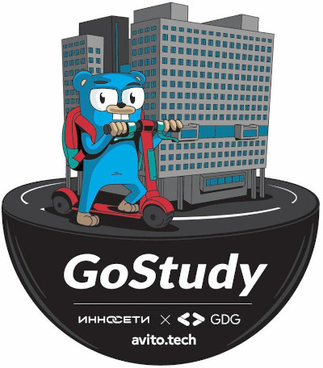

`Курс по Go организованный и проведенный: GDG Kalinigrad, Innoseti, AvitoTech  13.05.2020 - 24.06.2020`

# Go для начинающих
Этот курс основан на [книге](http://golang-book.com/) и её [русской](http://golang-book.ru/) версии, а также других источниках.

## Для кого курс
Курс предназначен для тех, кто хочет познакомиться с языком Go. Уровень не важен. Подходит как для тех кто имеет большой опыт и просто хочет познакомиться с языком, так и для тех кто только начинает погружаться в мир программирования.

# План курса
[План](./plan/plan.pdf)

## Занятие 1
#### Материалы
[Слайды урока](https://github.com/GDG-Cloud-Innopolis/Go-begginners/releases/download/v1.0.0/Go.Beginners.Innopolis.pdf)  
[Ссылка на домашнее задание](https://play.golang.org/p/1Jf-y7_Fy8j)  
#### Содержание
  * Приступая к работе  
  * Ваша первая программа  
  * Типы  
  * Переменные  

## [Занятие 2](https://www.meetup.com/GDG-Cloud-Innopolis/events/268532521/)
#### Материалы
[Открывающие слайды](https://github.com/GDG-Cloud-Innopolis/Go-begginners/releases/download/v1.1.0/Keyword2.pdf)  
[Слайды урока](https://github.com/GDG-Cloud-Innopolis/Go-begginners/releases/download/v1.1.0/Go.Beginners.Innopolis.2.pdf)  
[Ссылка на домашнее задание](https://play.golang.org/p/UeZfvGzBTUb)  
[Ссылка на домашнее задание со звёздочкой](https://play.golang.org/p/hlwxQM0rHmX)  
[Форма для сдачи домашнего задания](https://forms.gle/T3epCmce9UssFWPo9)  
#### Содержание
  * Управление потоком
  * Массивы, срезы, карты

## [Занятие 3](https://www.meetup.com/GDG-Cloud-Innopolis/events/268773574/)
[Слайды урока](https://github.com/GDG-Cloud-Innopolis/Go-begginners/releases/download/v1.2.0/Go.Beginners.Innopolis.3.pdf)  
[Ссылка на домашнее задание](https://play.golang.org/p/G6YMZMHnotU)  
[Ссылка на домашнее задание со звёздочкой](https://play.golang.org/p/wpefmNMZQWL)  
[Форма для сдачи домашнего задания](https://forms.gle/AcUQ9zH3BPtPoLoN6)  
#### Содержание
  * Функции
  * Указатели

## [Занятие 4](https://www.meetup.com/GDG-Cloud-Innopolis/events/268974970/)
[Слайды урока](https://github.com/GDG-Cloud-Innopolis/Go-begginners/releases/download/v1.3.0/Go.Beginners.Innopolis.4.pdf)   
[Ссылка на домашнее задание](https://play.golang.org/p/QeTIqPp3tbF)  
[Форма для сдачи домашнего задания](https://forms.gle/eA5htEBiQ9AVeCy78)  
[*Никита Кондратьев* - Tips & Tricks](https://github.com/GDG-Cloud-Innopolis/Go-begginners/releases/download/v1.3.0/Tips_Tricks.pdf)  
#### Содержание
  * Структуры и интерфейсы
  * Многопоточность

#### Tips & Tricks
**Никита Кондратьев (Разработчик, юнит SafeDeal, Авито)**

1. Принимайте интерфейсы, возвращайте структуры.
2. В Go отсутствует наследование как в ООП. Используйте интерфейсы.
3. Не злоупотребляйте interface{}.
4. Не перегружайте интерфейсы.
5. Если структура нужна только для того, чтобы реализовать интерфейс, не экспортируйте её.
6. Помните, что nill удовлетворяет любому интерфейсу.
7. Если нужно изменить данные структуры в методе, определите метод на указателе на структуру.
8. При объявлении нового типа на основе существующего, вы не наследуете методы. Для этого нужно использовать "встраивание" типов.
9. Держите в голове, что encoding/json может работать только с "публичными" полями структур.
10. Учитывайте, что тип и указатель на тип имеют разные наборы методов.

## [Занятие 5](https://www.meetup.com/GDG-Cloud-Innopolis/events/269128333/)
[Слайды урока](https://github.com/GDG-Cloud-Innopolis/Go-begginners/releases/download/v1.4.0/Go.Beginners.Innopolis.5.pdf)   
[Ссылка на домашнее задание](https://play.golang.org/p/_6SP-Dj79fY)  
[Форма для сдачи домашнего задания](https://forms.gle/pYfUzci4FMuPv8pb7)  
[*Вячеслав Бобик* - Tips & Tricks](https://github.com/GDG-Cloud-Innopolis/Go-begginners/releases/download/v1.4.0/package-naming-and-structuring.pdf)  
[*Сергей Иваненко* - Tips & Tricks](https://github.com/GDG-Cloud-Innopolis/Go-begginners/releases/download/v1.4.0/Unit.Go.Tips.and.Trics.pptx.pdf)  

#### Содержание
  * Пакеты и повторное использование кода
  * Тестирование

#### Tips & Tricks. Пакеты и повторное использование кода
**Вячеслав Бобик (Разработчик, юнит Messenger, Авито)**  
Именование пакетов
 - В чем смысл пакета
 - Примеры из стандартной библиотеки
 - ? Примеры реального проекта(как надо, как НЕ надо)
 - Несколько  best practices по именованию пакета
Организация пакетов
 - Подходы в организации пакетов
   - Монолит
   - Рельсы/Джанга/
   - Разбиение по модулям
   - Удобный вариант где расскажу про группировку основанную на доменных типах(а так же что это такое) и сервисах.
   - Где черпать вдохновение: пример на репозиторий go-package-layout
   - Луше маленькая копипаста, чем зависимость.

**Сергей Иваненко (Support Systems developer, Avito)**  
Рассмотрены будут примеры unit тестинга простых ф-ий, файлов, http клиентов, sql запросов. Будет проиллиюстированно как стороннипакеты(facker, mockery, spf13/afero) помогают в этом вопросе, поговорим о внедрении зависимостей и как это помогает при тестировании.  
Встроенные инструменты code coverace, benchmark.

План:
 - unit testing табличне тесты, просто тесты, приватные функции    Примеры File, websocket, httpClient, etc
 - вспомогательные инстурменты (facker, mockery)
 - TDD
 - Слоеная архитектура (циклическая зависимость) +/- различных подходов размещения unit_tests
 - code coverace
 - code race condition, parrallel
 - benchmark

## [Занятие 6](https://www.meetup.com/GDG-Cloud-Innopolis/events/269298234)
[Слайды урока](https://github.com/GDG-Cloud-Innopolis/Go-begginners/releases/download/v1.5.0/Go.Beginners.Innopolis.6.pdf)    
[Форма для сдачи домашнего задания](https://forms.gle/b3vD8FEhc1JKkYJ29)  
[*Иван Осадчий* - Tips & Tricks](https://github.com/GDG-Cloud-Innopolis/Go-begginners/releases/download/v1.5.0/Go.Standard.Library.pdf)  

#### Содержание
  * Стандартная библиотека
  * Дальнейшие шаги

#### Tips & Tricks. Стандартная библиотека.
Иван Осадчий (Разрабочтик, юнит Monetization, Авито)

  - Идеология: какой задумывалась Go stdlib
  - Масштаб проблемы: размер, функциональность
  - Как ориентироваться в stdlib?
  - Часто используемые пакеты
  - Полезные комбо: как пакеты работают вместе
  - Чего нет в стандартной библиотеке и почему?
  - Как искать пакеты под свои нужды?
  - Как переиспользовать наработки коллег?
  - Что дальше: куда копать, что важно знать?

## Преподаватели
Эмиль [@litleleprikon](https://tttttt.me/litleleprikon)  
Алик [@alikhil](https://tttttt.me/alikhil)  
Искандер [@quasilyte](https://tttttt.me/quasilyte)  

## Tips & Tricks
Вячеслав Бобик [Avito](https://tttttt.me/victor3)  
Никита Кондратьев [Avito](https://tttttt.me/nskondratev)  
Иван Осадчий [Avito](https://tttttt.me/ivan_os)  
Сергей Иваненко [Avito](https://tttttt.me/SergeyWh1te)  

## Организация
Оля [@luzhajka](https://tttttt.me/luzhajka)  
Раис [@rais_khadeev](https://tttttt.me/rais_khadeev)  
Кирилл [@kirilldemtchenko](https://tttttt.me/kirilldemtchenko)  
Миша [@oldtuna](https://tttttt.me/oldtuna)
